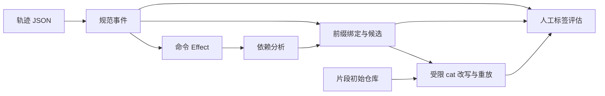

# 架构概览

## 摘要

TraceOpt 将轨迹读取、保守依赖分析、前缀绑定和受限重放分成独立步骤。
已有能力及适用边界见 [项目状态](../../PROJECT_STATE.md)；并非只有规划，也未证明任意工具调用都可优化。

## 职责与非职责

提供从输入身份到执行证据的路径，区分“结构候选”与“已通过重放”。
不运行完整 LLM 会话，不替代 shell，不自动推断工作目录，也不承诺模型成本收益。

## 输入与输出

输入为已支持 mini-swe-agent-1.1 JSON、显式逐调用 cwd，以及重放所需的片段初始仓库。
输出为规范事件、Effect、带路径证据的依赖、候选计划、逐项执行与状态报告。
评估额外接收人工标签和固定配置，输出原始结果及统计，不自行授予 verified。

## 模块与数据结构

| 模块 | 核心对象 | 边界 |
|---|---|---|
| [trajectory](../../src/traceopt/trajectory.py) | Event、Trajectory | 只读解析与输入 SHA-256，保留 pending |
| [semantics](../../src/traceopt/semantics.py) | CommandEffect | 白名单词法效果，不执行命令 |
| [dependency](../../src/traceopt/dependency.py) | Dependency、TrajectoryAnalysis | RAW/WAR/WAW 与 unknown 屏障 |
| [binding](../../src/traceopt/binding.py) | LoopPlan、DetectedLoop | 前缀构造与完整后缀匹配分离 |
| [replay](../../src/traceopt/replay.py) | StateEntry、CommandResult、ReplayReport | 固定工具、同状态执行和比较 |
| [evaluation](../../src/traceopt/evaluation.py) | JSON 逐例记录与汇总 | 基线、单因素消融、分母与原始证据 |
| [cli](../../src/traceopt/cli.py) | UTF-8 JSON | inspect/export/analyze，输出不覆盖 |

## 算法与调用路径

依赖模块按所有先后调用对提取直接资源冲突；绑定使用同一依赖构建逻辑检查枚举后的写入。
重放重新核对候选身份和枚举，恢复同一路径下的初始状态，再比较逐项结果和仓库快照。
评估生产方法保持依赖检查，私有消融入口只用于研究比较，不放宽重放验证。

## 不变量与假设

未知信息不等于安全；缺失返回不等于成功；结构匹配不等于执行等价。
前缀计划不得读取未来输出或 cwd。正式数字只由 QA 验证后登记。
词法 POSIX 路径模型需要明确上下文；执行需要可信工具、普通无别名仓库及无并发修改。

## 错误处理

解析、语义未知、重放前提不满足分别保留明确错误或原因。CLI 输入/输出错误返回 2。
评估对预期重放失败保留分母；无候选的未定义比率是 null，不当作全部成功。
输出证据不覆盖，流程中断按机器状态和报告恢复，不能靠聊天记忆跳过 QA。

## 复杂度

解析随输入大小增长；依赖需要两两比较调用及资源集合。当前实现面向可审计的小规模片段，
未对整库优化或大规模吞吐作性能承诺。重放开销受仓库复制、哈希与外部工具执行影响。

## 已知限制

固定 GPT Responses `response/output/function_call/function_call_output` 结构已支持，未知 item、流式和并行语义拒绝；固定真实来源覆盖不是全数据集兼容。
生产轨迹中受限绑定正例仍不足；检测支持的只读模板多于可执行 cat 模板。
临时副本不是操作系统安全沙箱；仓库比较忽略 atime，不比较所有外部状态。
人工挑战集不是独立留出样本；不提供端到端模型优化收益。

## 测试策略与需求

各模块单元测试、真实映射集成、前缀泄漏对抗、实际工具重放、两套挑战与独立计分重算。
见 [发布审计](../release_audit.md)、[REQ-001～014](../../REQUIREMENTS.md)、[影响图](../../IMPACT_MAP.md)。
无新增 Accepted ADR；选择与范围已记录在各轮计划及模块文档。

## 面试说明

先解释可以验证的对象，再说明未知和拒绝范围；使用 [面试材料](../interview/INDEX.md)，不从绿色测试推导普遍正确性。

